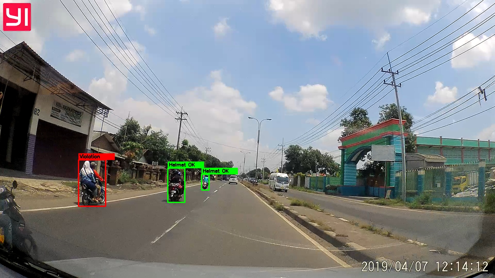
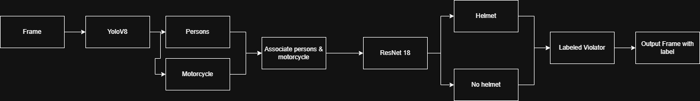

# Helmet Presence Detection 🏍️🪖

A lightweight, multi-stage pipeline to detect motorcyclists and determine helmet presence in dashcam images by combining a YOLO-based object detector and a ResNet-18 helmet classifier.

This project is an improved redesign of my bachelor thesis, focusing on efficiency, robustness, and real-world applicability.



---

## 🚀 Features



- Detect persons and motorcycles using Ultralytics YOLOv8
- Associate riders with motorcycles using IoU and distance heuristics
- Classify helmet / no-helmet using a ResNet-18 classifier
- Support multiple riders on a single motorcycle
- Entity-level decision logic (per motorcycle)
- Confidence-aware visualization
  - 🟥 Red = Violation
  - 🟨 Yellow = Uncertain
  - 🟩 Green = Helmet OK
- Lightweight inference suitable for dashcam images
- Training script with class-weighting support for imbalanced data

---

## 🎓 Background & Motivation

The original bachelor thesis pipeline relied heavily on sliding windows and multiple CNN models, which caused high computational cost and poor scalability.

### Previous pipeline

- Sliding windows
- → CNN (motorcyclist detection)
- → ResNet (classify number of persons)
- → ResNet (classify number of helmets)
- → Final decision

### Problems with the previous approach

- Computationally expensive due to sliding windows
- Poor performance on high-resolution images
- Hard to handle overlapping motorcycles
- Multiple heavy models increased inference latency
- No uncertainty handling

---

## 🔁 Improvements in this pipeline

### Current pipeline

- YOLOv8 (person + motorcycle detection)
- → Rider–motorcycle association
- → ResNet-18 (helmet / no-helmet classification)
- → Entity-level decision

### Key improvements

- Eliminates sliding windows
- Uses a single detector for localization
- Runs helmet classification only on relevant rider regions
- Handles multiple riders per motorcycle
- Lower inference cost
- Easier to extend and maintain

---

## 🔧 Requirements

Install dependencies from `requirements.txt` (recommended to use a virtual environment):

```bash
python -m venv .venv
.\.venv\Scripts\Activate.ps1
pip install -r requirements.txt
```

> **Note:** torch and torchvision are pinned to CUDA 12.1 wheels. Install compatible versions if using a different CUDA setup or CPU-only.

### 📁 Repository Structure

```
data/
 └─ helmet/
    ├─ train/
    │  ├─ helmet/
    │  └─ no_helmet/
    └─ val/
       ├─ helmet/
       └─ no_helmet/
```

- `detector/` — YOLO inference & association logic
- `models/` — detection model placeholders
- `weights/` — trained classifier weights
- `sample/` — example images
- `assets/` — diagrams and plots
- `*.py` — training and inference scripts

---

## ▶️ Inference

**Person & motorcycle detection**

```bash
python person_motorcycle_infer.py --img sample/dashcam.jpg
```

**Helmet classifier only**

```bash
python helmet_classifier_infer.py --img sample/helmet.jpg
python helmet_classifier_infer.py --dir sample/
```

**Full pipeline**

```bash
python frame_infer.py --img sample/dashcam.jpg
```

---

## 🏋️ Training the Helmet Classifier

```bash
python train_helmet_classifier_resnet18.py
```

**The script:**

- Uses ResNet-18 pretrained on ImageNet
- Applies class weighting for dataset imbalance
- Tracks F1-score and recall for the no-helmet class
- Saves best weights to `weights/helmet_resnet18_best.pth`

---

## 🧠 How It Works

- YOLOv8 detects persons and motorcycles
- Riders are associated with motorcycles using spatial heuristics
- Rider regions are cropped and passed to ResNet-18

**Decisions are made at the motorcycle level:**

- Any rider without helmet → red box
- Any uncertain prediction → yellow box
- All riders wearing helmets → green box

---

## ⚠️ Limitations

- **Dataset bias:** Helmet dataset is mainly captured from behind. Performance may drop when riders face the dashcam.
- **No temporal tracking:** Each frame is processed independently.
- **Heuristic association:** Rider–motorcycle matching is rule-based, not learned.
- **Challenging conditions:** Night scenes, motion blur, and heavy occlusion are not explicitly handled.

---

## 🔮 Future Work

- Add multi-object tracking for video stability
- Expand dataset with front and side views
- Replace heuristics with learned association models
- Export models to ONNX / TensorRT for real-time deployment

---

## 📚 Previous Work / Publication

This project is an improved and optimized implementation of the approach presented in:

**Helmet Usage Detection on Motorcyclist Using Deep Residual Learning**  
Richard Sugiarto, Evan Kusuma Susanto, Yosi Kristian. Proceedings of the 2021 3rd East Indonesia Conference on Computer and Information Technology (EIConCIT), April 2021. [DOI](https://doi.org/10.1109/eiconcit50028.2021.9431914)

> Note: This repo modernizes the original method by replacing sliding windows and multiple CNNs with a YOLOv8-based detector and a single ResNet-18 classifier for helmet detection, improving efficiency and multi-rider support.

---

## ⚙️ Notes

**Default model & weight paths:**

```
models/yolov8s.pt
weights/helmet_resnet18_best.pth
```

---

## Contributing

Contributions, issues, and pull requests are welcome.
